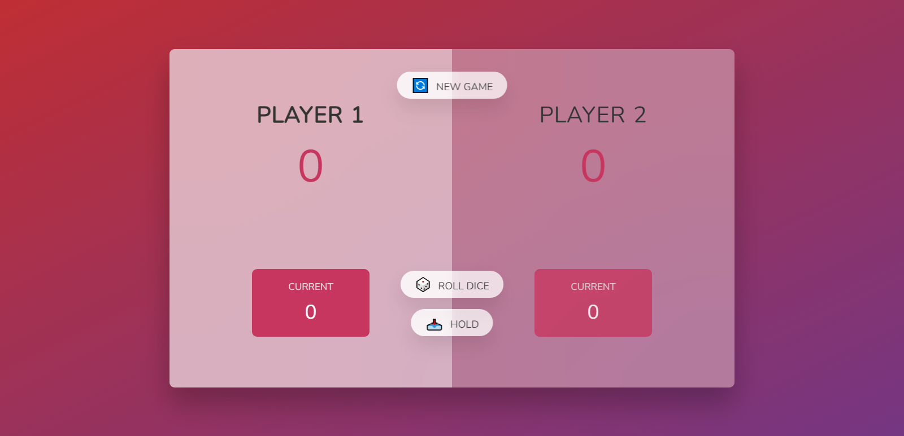

# Pig Game 🎲

## About the Project

**Pig Game** is a digital rendition of the classic dice game that combines strategy and luck. Players take turns rolling a dice to accumulate points, but beware! Rolling a 1 forfeits the turn and resets all unbanked points. The first player to reach 100 points wins.

This project is inspired by Jonas Schmedtmann's implementation and demonstrates dynamic DOM manipulation, event handling, and responsive design principles.

---

---

## Features

- 🎮 **Interactive Gameplay**: Players can roll the dice, hold their scores, or start a new game with simple controls.
- 🎨 **Modern UI/UX**: Clean and responsive design with visual feedback for active players and winners.
- ⚡ **Dynamic Logic**: Handles game rules and player turns efficiently using JavaScript.
- 📱 **Responsive Design**: Works seamlessly across different screen sizes.

---

## How to Play

1. 🎲 **Roll the Dice**: Click "Roll Dice" to generate a random number (1-6).
2. 🛑 **Avoid Rolling a 1**: Rolling a 1 forfeits your turn and resets your current score.
3. 💾 **Hold Your Score**: Click "Hold" to bank your current points into your total score.
4. 🏆 **Win the Game**: Be the first player to score 100 points to win!

---

## File Structure

- **index.html**: Contains the main HTML structure and links to CSS and JS files.
- **style.css**: Defines the styles for the game, ensuring a polished and responsive design.
- **script.js**: Implements the game logic, event listeners, and DOM updates.

---

## Technologies Used

- **HTML**: Structure of the application.
- **CSS**: Styling and layout.
- **JavaScript**: Game logic and interactivity.

---

## Contributions

Contributions are welcome! Feel free to open issues or submit pull requests for improvements.

---

## License

This project is distributed under the **MIT License**.  
Original game implementation and design by [Jonas Schmedtmann](https://github.com/jonasschmedtmann).  
Feel free to modify and use the code with proper attribution.

---

## Acknowledgments

- Jonas Schmedtmann for the original concept and implementation.
- Resources and tutorials that helped bring this project to life.
